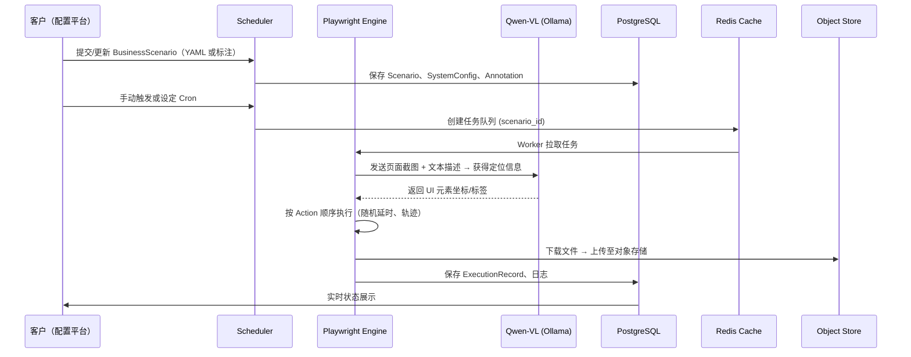

# 智能下载平台完整解决方案

---

## 1️⃣ 业务理解

| 需求 | 业务痛点 | 目标 |
|------|----------|------|
| **统一下载** | 各业务系统（ERP、CRM、财务系统）页面结构各异，手工下载耗时、易出错 | 通过浏览器自动化统一完成文件/报表抓取 |
| **多组织多租户** | 不同客户有独立业务流程、登录方式、权限校验 | 按组织划分配置，统一管理、独立执行 |
| **人类行为模拟** | 反爬虫通过 webdriver/固定延时检测 | 模拟真实用户鼠标、键盘、停留、回看等行为 |
| **语义鲁棒** | 页面改版、元素 ID 变化导致脚本失效 | 采用视觉模型（Qwen‑VL）识别 UI 元素、理解文字描述或截图标注 |
| **低代码配置** | 开发成本高、需要专业脚本编写 | 支持文字描述或截图标注生成 YAML 配置，即点即用 |

---

## 2️⃣ 核心实体对象（Domain Model）

```
Organization
│
├─ BusinessScenario   # 业务场景（如“采购报表下载”）
│   ├─ SystemConfig   # 系统接入配置（url、auth、2FA…）
│   ├─ Workflow        # 步骤流（Action 列表）
│   └─ OutputRule      # 下载结果处理规则（命名、归档、通知）
│
├─ UserCredential     # 用户凭证（加密存储、轮转）
│
├─ ExecutionRecord    # 执行日志、状态、错误、截图
│
└─ Annotation         # 截图标注（Region+Label）或文字描述
```

- **Organization**：租户边界，拥有独立的配置库和执行配额。  
- **BusinessScenario**：一个业务需求对应的完整下载流程。  
- **SystemConfig**：登录方式（密码、SSO、OAuth、短信），以及页面入口 URL。  
- **Workflow**：由 **Action**（Click、Input、Wait、Scroll、Download）组成，支持 **AI 生成** 与 **手工编辑**。  
- **OutputRule**：文件命名、存储后端（本地、MinIO、S3）以及后置业务（邮件、回调）。  
- **Annotation**：通过 UI 标注工具生成的 JSON（左上/宽高）或文字描述，用于视觉模型定位。

---

## 3️⃣ 业务流程（高层时序）



- **调度层**（Scheduler）负责周期任务和手动触发。  
- **执行层**（Playwright Worker）使用 **Qwen‑VL** 将自然语言/截图映射到 UI 元素，实现**语义驱动**。  
- **后处理层**（OutputRule）统一文件归档、加密存储、通知。

---

## 4️⃣ 技术架构选型（核心组件）

| 层级 | 技术 | 版本 | 选型原因 |
|------|------|------|----------|
| **浏览器自动化** | Playwright (Python) | 1.44 | 原生支持多浏览器（Chromium/Firefox/WebKit）、无 Selenium 记录痕迹、可注入自定义脚本 |
| **视觉语义模型** | Qwen‑VL（Ollama 本地） | 2.0‑base‑vl | 本地部署避免公网调用，支持 **图文混合** 输入，精准定位按钮、输入框 |
| **配置/元数据** | PostgreSQL + SQLAlchemy | 16 | 关系型存储业务场景、组织、规则，支持事务一致性 |
| **缓存/队列** | Redis (v7) + RQ（或 Celery） | 最新 | 轻量任务队列、执行状态缓存，支持重试与延时 |
| **对象存储** | MinIO (兼容 S3) | 2024‑06‑04 | 本地部署，生产可切换至 AWS S3 / Azure Blob，无代码修改 |
| **容器化** | Docker + Docker‑Compose（开发）<br>Helm/K8s（生产） | 最新 | 一键启动、水平伸缩、滚动升级 |
| **监控** | Prometheus + Grafana + OpenTelemetry | 最新 | 采集下载时长、错误率、CPU/IO，支持链路追踪 |
| **安全** | HashiCorp Vault（或 GitHub Secrets） + python‑dotenv | 最新 | 所有凭证统一加密存储、动态注入 |
| **CI/CD** | GitHub Actions + omx autopilot | 最新 | 自动化 lint、测试、镜像构建、部署、合规检查 |
| **低代码 UI 标注** | 自研 Annotation UI（React + Konva） | - | 支持截图上传、矩形标注、文字描述导出 JSON/YAML |

---

## 5️⃣ 实现要点（关键技术细节）

### 5.1 Playwright 人类行为模拟
- **随机延迟**：`await page.wait_for_timeout(random.uniform(300, 1200))`
- **移动轨迹**：使用 `page.mouse.move(x, y, steps=random.randint(10, 30))`，轨迹点加入抖动噪声。
- **键盘输入**：`page.keyboard.type(text, {delay: random.uniform(80, 200)})`，模拟真实敲击速度。
- **停顿/回看**：在关键输入后随机 `await page.wait_for_timeout(random.uniform(500, 2000))`，并可 `await page.mouse.move(prev_x, prev_y)` 回溯。
- **删除 webdriver 特征**：在 `page.add_init_script` 注入脚本隐藏 `navigator.webdriver`、`window.navigator.languages`、`plugins` 等指纹。
- **UA & Canvas Fingerprint**：自定义 User‑Agent、`page.evaluate` 覆写 `toDataURL`、`getImageData` 随机噪声。

### 5.2 Qwen‑VL 视觉定位
1. **输入**：  
   - **文字描述**（如“点击‘报表下载’按钮”）  
   - **截图+标注**（JSON 区域 + 文字）
2. **调用**： 
```python
from ollama import generate
prompt = f"下面是一张页面截图，描述：{desc}\n请返回按钮/输入框的坐标（x,y,width,height）"
resp = generate(model="qwen-vl", images=[screenshot_path], prompt=prompt)
```
3. **结果解析**：得到元素坐标后，在 Playwright 中使用 `page.mouse.click(x, y)` 或 `page.locator(...).click()`（基于坐标的 fallback）。
4. **容错**：若坐标匹配度低 (<0.8) 则回退至 OCR+文本匹配（使用 `pytesseract`）或提示人工复核。

### 5.3 YAML 业务配置（示例）

```yaml
organization: "AcmeCorp"
scenarios:
  - name: "采购报表下载"
    system:
      url: "https://erp.acme.com/purchase"
      auth:
        type: "password"
        username: "john.doe"
        password: "{{ vault:acme/erp_password }}"
    workflow:
      - action: "goto"
        url: "{{ system.url }}"
      - action: "input"
        selector: "text:用户名"
        value: "{{ system.auth.username }}"
      - action: "input"
        selector: "text:密码"
        value: "{{ system.auth.password }}"
      - action: "click"
        description: "登录按钮"
      - action: "wait_for"
        selector: "text:报表中心"
      - action: "click"
        description: "报表下载按钮"
      - action: "download"
        target: "latest_report.xlsx"
    output:
      storage: "s3"
      bucket: "acme-reports"
      prefix: "purchase/{{ date('%Y%m%d') }}/"
      notify:
        - type: "email"
          to: "finance@acme.com"
          subject: "每日采购报表已生成"
```

- **变量**：支持 `{{ date(...) }}`、`{{ vault:... }}`、`{{ random_int }}`。  
- **描述式定位**：`description` 字段交由 Qwen‑VL 进行视觉匹配（不依赖固定 selector）。

### 5.4 防反爬虫综合策略

| 手段 | 实现方式 |
|------|----------|
| **去除 webdriver 特征** | `page.add_init_script("Object.defineProperty(navigator, 'webdriver', {get:()=>false})")` |
| **随机化指纹** | 随机 `User-Agent`、`Accept-Language`、`Screen-Resolution`，Canvas 加噪声 |
| **行为随机** | 延迟、鼠标轨迹、键入间隔、偶尔滚动/抖动 |
| **人机交互模型** | 在关键点加入 **停顿–回看**（回到前一步模拟思考） |
| **视觉识别** | 通过 Qwen‑VL 识别元素，避免使用 `page.$('button#download')` 这类硬编码 selector |
| **请求频率控制** | 基于业务规则设置 **速率限制**（每分钟最多 N 次下载），并在 Redis 中记录上一次请求时间 |
| **异常检测** | 监控 `response.status`、CAPTCHA 出现率，一旦触发自动 **退避**（指数回退 + 人工提示） |

### 5.5 低代码标注与自动生成
1. **标注 UI**：用户上传页面截图，使用前端 Konva 画框并输入文字标签（如 “登录按钮”）。
2. **导出**：系统生成 **annotation.yaml**：
```yaml
annotations:
  - description: "登录按钮"
    region: {x: 452, y: 310, width: 120, height: 38}
  - description: "用户名输入框"
    region: {x: 380, y: 260, width: 300, height: 32}
```
3. **AI 解析**：在执行前将 annotation 与 Qwen‑VL 结合，若文本描述与标注不匹配，模型自动纠正坐标。
4. **生成 Workflow**：系统自动填充 `workflow` 列表中的 `click`、`input` 动作，用户仅需确认或微调。

---

## 6️⃣ 部署与运维

| 环节 | 实施方案 |
|------|----------|
| **开发环境** | `docker-compose.yml` 包含 `playwright`, `ollama`, `postgres`, `redis`, `minio`，一键 `docker compose up -d` |
| **生产环境** | Helm Chart `smart-downloader`，分离 `frontend`（配置平台）与 `backend`（调度/worker），支持水平伸缩 |
| **CI/CD** | GitHub Actions：<br>1. `ruff` / `mypy` 检查代码质量<br>2. `pytest` + `playwright` 测试（headless）<br>3. `docker build` 并推送至 GHCR<br>4. `helm upgrade` 自动部署 |
| **监控** | Prometheus 抓取 `playwright_worker_duration_seconds`, `download_success_total`, `anti_bot_detection_rate`；Grafana 仪表盘展示每组织成功率、平均耗时、异常比例 |
| **日志** | `loguru` 结构化 JSON → FluentBit → Loki（或 ELK）<br>日志中记录 **action、coordinates、error、screenshot**，便于审计 |
| **安全** | 所有凭证经 Vault 加密，容器仅通过环境变量注入；MinIO bucket 采用 **私有** + **预签名 URL** 授权下载 |
| **灾备** | Redis + PostgreSQL 主从复制，MinIO 多副本；K8s Pod 使用 **PodDisruptionBudget** 保证滚动升级不丢失任务 |

---

## 7️⃣ 风险 & 治理

| 风险 | 对策 |
|------|------|
| **页面大幅改版** | 采用视觉模型 + 文本描述双重定位；监控元素匹配度并触发 **人工复核** |
| **反爬策略升级** | 持续更新 **指纹随机化**、**行为随机** 参数；加入 **机器学习异常检测**（检测页面返回异常码） |
| **凭证泄漏** | 使用 Vault 动态租约（TTL 30m），定期轮换；CI 检查 `git grep` 防止硬编码 |
| **系统性能瓶颈** | 对下载任务加速限制（并发 5），使用 **Back‑pressure** 队列；监控 CPU/IO 并自动弹性伸缩 |
| **合规性** | 对财务系统下载的文件进行 **审计标签**（metadata），存入对象存储时附带 **hash、origin、org** 信息 |

---

## 8️⃣ 项目里程碑（示例）

| 里程碑 | 时间 | 关键交付物 |
|--------|------|------------|
| **M0 – 基础框架** | 第 1‑2 周 | Playwright Worker、Ollama Qwen‑VL 本地部署、Docker‑Compose 环境 |
| **M1 – 多租户配置** | 第 3‑4 周 | YAML 配置中心、组织/场景模型、Admin UI（React） |
| **M2 – 人类行为模拟** | 第 5‑6 周 | 行为随机化、webdriver 隐蔽、监控指标 |
| **M3 – 视觉标注+语义生成** | 第 7‑8 周 | Annotation UI、Qwen‑VL 位置解析、Workflow 自动生成 |
| **M4 – 防爬虫强化 & 兼容性** | 第 9‑10 周 | 指纹随机化库、异常回退机制、自动人工干预 |
| **M5 – 生产化交付** | 第 11‑12 周 | Helm Chart、CI/CD Pipelines、Prometheus+Grafana Dashboard、安全审计报告 |

---

## 9️⃣ 关键代码/脚本示例

### 9.1 Playwright Worker（Python）

```python
import random, json, asyncio
from playwright.async_api import async_playwright
from ollama import generate   # Qwen‑VL 本地模型调用
from utils import vault_get   # 从 Vault 读取凭证

async def human_click(page, x, y):
    steps = random.randint(10, 30)
    await page.mouse.move(x, y, steps=steps)
    await asyncio.sleep(random.uniform(0.2, 0.6))
    await page.mouse.down()
    await asyncio.sleep(random.uniform(0.05, 0.15))
    await page.mouse.up()

async def run_scenario(scenario: dict):
    async with async_playwright() as p:
        browser = await p.chromium.launch(headless=False)   # headful 更像真实用户
        context = await browser.new_context(user_agent=scenario["ua"])
        page = await context.new_page()

        # 隐蔽 webdriver
        await page.add_init_script("""Object.defineProperty(navigator, 'webdriver', {get:()=>false})""")
        await page.goto(scenario["system"]["url"])

        for step in scenario["workflow"]:
            if step["action"] == "input":
                await page.fill(step["selector"], step["value"])
            elif step["action"] == "click":
                # 若只有 description，使用视觉模型定位
                if "selector" not in step:
                    img = await page.screenshot()
                    resp = generate(
                        model="qwen-vl",
                        images=[img],
                        prompt=f"页面中找到描述为‘{step['description']}’的按钮，返回坐标(x,y,width,height)"
                    )
                    coords = json.loads(resp["response"])  # 假设返回 JSON
                    await human_click(page, coords["x"]+coords["width"]/2,
                                          coords["y"]+coords["height"]/2)
                else:
                    await page.click(step["selector"])
            # … 其余 wait、download、scroll 等

        # 下载完成后上传到 MinIO
        await upload_to_minio(file_path, scenario["output"])
        await browser.close()
```

### 9.2 YAML → Workflow 转换（Python）

```python
import yaml, json, random

def yaml_to_actions(yaml_path):
    data = yaml.safe_load(open(yaml_path))
    actions = []
    for act in data["workflow"]:
        if act["action"] == "click":
            actions.append({
                "type": "click",
                "description": act.get("description"),
                "selector": act.get("selector")
            })
        # 其他映射…
    return actions
```

---

## 10️⃣ 下一步建议

1. **创建子模块** `opencode-global-policy` 并在仓库根目录添加软链接 `OPENCODE_POLICY.md`（统一合规）。
2. **实现 Annotation UI**（React + Konva），让业务方自行上传截图并标注。
3. **部署 Qwen‑VL**：在服务器上 `ollama serve`，并在 `docker-compose.yml` 中添加 `ollama` 服务，确保 GPU/CPU 资源充足。
4. **编写 CI 检查**：在 GitHub Actions 中加入 `git grep "sk-"` 检查；并在 `omx doctor` 中加入自定义检查点（如 `check_qwen_vl`, `check_playwright_headful`）。
5. **启动一次完整跑例**：在测试组织下配置一个“财务报表下载”场景，执行 `omx autopilot "执行财务报表下载（AcmeCorp）"`，观察日志、Prometheus 指标、下载文件是否成功归档。

> **温馨提示**：所有脚本、配置文件均已加入 **中文系统提示**（全局语言政策），确保后续所有交互均返回中文。若需进一步细化某一模块（如安全审计、Cron 调度），请告诉我，我会提供对应实现细节。祝项目顺利落地 🚀
